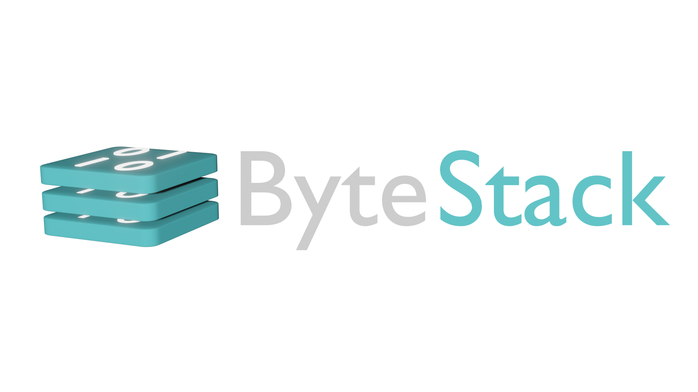

# Livrum

## Definição

O objetivo do **Livrum** é fornecer uma aplicação web com acesso disponível em computadores e dispositivos mobile para intermediar a venda de e-Books de escritores para seus leitores. Sua função é proporcionar um espaço para que autores e editoras disponibilizem suas obras para venda em formato digital e para que leitores encontrem e adquiram facilmente e-Books de seu interesse.

O software é desenvolvido pela Empresa **ByteStack**, cuja equipe é descrita abaixo.

---

## Equipe

- Alex
- Almir
- Anderson
- Brenda
- Bruno
- Caio
- Carlos
- Diego
- Elmer
- Luciano
- Mateus

---

O objetivo desse repositório é armazenar os arquivos de:

- Design
- Discussão
- Metas
- Relatórios

Do projeto da disciplina EXA 857 do Semestre 23.2 da UEFS.